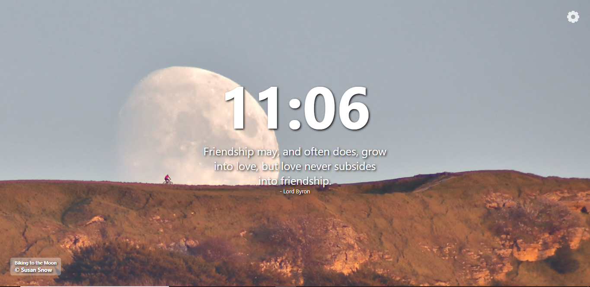

# Astrominia-Chrome-Extension
Beautiful Images from NASA and Quotes on Every New Tab You Open.

## Live Preview
See How the Extension will work on Opening a New Tab, without actually installing remotely on your browser. [Click Here.](https://astrominia.netlify.app/)

## Screenshot Preview

## APIs used
1) [NASA APoD](https://api.nasa.gov/)

   Sends a new Image everyday.

2) [Quotable](https://api.quotable.io/)

   Gives a Wisdom.
   
## Supported Browsers
   1) Google Chrome.
   2) New Microsoft Edge.
   
## How to Install
Install from the Chrome Webstore. [link](https://bit.ly/3eSqWOc)

Install the Extension in your Browser Manually(for Developers).

1) Step 1: Download the repository, a .zip file will be downloaded, extact the zip file.
2) Step 2: Open your Browser, type <strong>chrome://extensions</strong> in case of Chrome or <strong>edge://extensions</strong> in case of Edge and hit enter.
3) Step 3: When you enter that settings page you will see a Developer Mode Toggler(Top-right in Chrome and Bottom-left n Edge), toggle it on.
   You will see a <strong>Load Unpacked</strong> tab on the top.
4) Step 4: Click on <strong>Load Unpacked</strong> and select the Folder directory where you have unzipped the downloaded folder.

<h2> Voilà! Your Extension has been installed Manually by you.</h2>

## License
[MIT](https://choosealicense.com/licenses/mit/)
